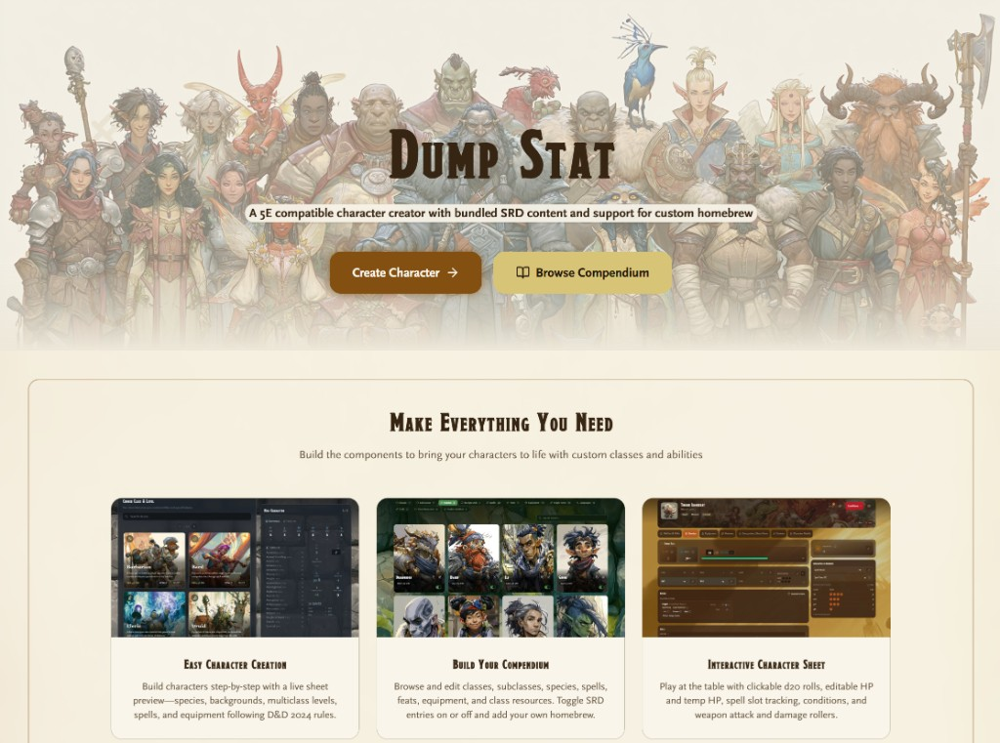

# Dump Stat

[](https://geph.github.io/dump-stat-character-builder/)

A 5E-compatible character builder and compendium. **[Try the live app](https://geph.github.io/dump-stat-character-builder/)** (static GitHub Pages, data stays in your browser). Current release: **0.25**.

**Maximally customizable by design.** Nearly every mechanical decision — species, classes, subclasses, feats, spells, equipment, backgrounds, creatures & companions, custom abilities, and the modifier effects behind them — is editable in-app from a single shared catalog. The same wiring that powers the bundled SRD content can process your own imported homebrew.

**Author and purpose.** Hi all, I'm Jeff and this is a hobby project of mine. I made this app because I really wanted a character creator and interactive sheet that does custom classes! There are so many outstanding D&D content creators out there like [Kibbles Tasty](https://www.kthomebrew.com/), [Mage Hand Press](https://magehandpress.com/) or [Laserllama](https://www.gmbinder.com/profile/laserllama) who make content that's brilliant but too complicated to easily adapt to D&D Beyond or Foundry VTT (those are great and I think you should support them too!). While I'd like for this app to remain open source and free for everyone I won't say no if you'd like to [buy me a coffee](https://buymeacoffee.com/geph). The first thing I plan to do with any money raised by the project is pay a real artist for art. 

Please note that I'd like to keep the scope of this app to assisting play at a physical table (so no VTT ever) but I am open to feature suggestions and could absolutely use your help [identifying bugs to fix](https://github.com/Geph/dump-stat-character-builder/issues).

## Contents

- [Features](#features)
- [Tech stack](#tech-stack)
- [Requirements](#requirements)
- [Quick start](#quick-start)
- [Deployment](#deployment)
- [Local card art](#local-card-art-optional)
- [Troubleshooting](#troubleshooting)
- [Project structure](#project-structure)
- [License & credits](#license--credits)

## Features

### Character builder
- Guided creation through species, class, ability scores, background, gear, spells, and details
- Multiclass with independent levels, plus a live sheet preview
- Player-choice modifiers (skills, tools, languages, weapon masteries, feat grants) at the step where they apply
- Point buy and standard array; HP, AC, attacks, saves, and skills calculate automatically

### Compendium
- Seed the full SRD 5.2.1 catalog, then create or edit anything
- One **common modifier** catalog: class features, feats, species traits, and custom abilities pick the same effects (resources, spell grants, creature grants, level-scaling dice, …)
- Creatures & companions as a first-class type, including Wild Shape, familiars, steeds, and summons
- Card art on browse cards and detail overlays; enable/disable entries for the builder
- Class resource pools (Rage, Ki, Superiority Dice, …) linked from feature limited uses

### Play
- Condensed character sheet with rolls, HP tracking, companion / beast-form tab, duration reminders, and class-feature toggles
- Level-up wizard for new features, subclass unlocks, and ASI / feat picks
- Save characters (MySQL hosted, or IndexedDB in static mode) and export JSON

### Import
- One-click SRD seed (no AI)
- Dump Stat JSON and Foundry VTT JSON (no AI)
- BYO LLM clipboard (paste text → copy prompt → paste JSON) without server keys
- Optional server AI for PDF / text extraction (OpenAI, Anthropic, or Gemini)
- Name-collision handling (update, replace, or rename)

Formats, multi-file order, and AI keys: **[docs/import.md](docs/import.md)**.

## Tech stack

- **Framework:** Next.js 16 (App Router) + React 19
- **Data:** MySQL 8+ with Drizzle (hosted) or IndexedDB (static)
- **UI:** Tailwind CSS 4, shadcn/ui, Lucide + Game Icons
- **Validation / tests:** Zod, Vitest

## Requirements

- Node.js 20+
- pnpm (via Corepack) or npm
- **Hosted mode only:** MySQL 8+

The browser never connects to MySQL directly. Only the Next.js server uses database credentials from environment variables.

## Quick start

Pick a profile first:

| Profile | Storage | When to use |
|---------|---------|-------------|
| **Static** | IndexedDB in the browser | Try the app, GitHub Pages, no database |
| **Hosted** | MySQL via `/api/*` | Self-host, multi-device save, PDF/server AI import |

### Static (no MySQL)

```bash
git clone https://github.com/Geph/dump-stat-character-builder.git
cd dump-stat-character-builder
corepack enable
pnpm install
pnpm build:static
npx serve out
```

Or just use the [live Pages build](https://geph.github.io/dump-stat-character-builder/). Details: [deploy/github-pages.md](deploy/github-pages.md).

### Hosted local development

```bash
git clone https://github.com/Geph/dump-stat-character-builder.git
cd dump-stat-character-builder
corepack enable
pnpm install
cp .env.example .env.local
```

Create a MySQL database, then either:

```bash
pnpm db:setup
```

or import `mysql/schema.sql` yourself. Set `DATABASE_URL` (or `MYSQL_*`) in `.env.local`. URL-encode special characters in passwords.

```bash
pnpm dev
```

Open [http://localhost:3000](http://localhost:3000), go to **Import**, and click **Seed SRD 5.2.1 Content**, or `curl -X POST http://localhost:3000/api/seed`.

After pulling schema updates:

```bash
pnpm db:migrate
```

If `pnpm` is not on your PATH, use `corepack pnpm …`. Remote MySQL often needs an SSH tunnel (`ssh -N -L 3307:127.0.0.1:3306 user@host`) and `DATABASE_URL` pointing at `127.0.0.1:3307`.

**Optional AI import:** add one of `OPENAI_API_KEY`, `ANTHROPIC_API_KEY`, or `GOOGLE_GENERATIVE_AI_API_KEY` to `.env.local`. Without a key, seed, JSON, Foundry, and BYO clipboard still work. See [docs/import.md](docs/import.md#server-ai-keys-optional).

## Deployment

Dump Stat is a **build-time** profile. There is no runtime toggle in the deployed app.

| Profile | Command | Storage | Target |
|---------|---------|---------|--------|
| **Hosted** (default) | `pnpm build:hosted` | MySQL | VPS / Node (`pnpm start`) |
| **Static** | `pnpm build:static` | IndexedDB | GitHub Pages (`out/`) |

- **Static:** [deploy/github-pages.md](deploy/github-pages.md) — live at `https://geph.github.io/dump-stat-character-builder/`. Includes builder, characters, compendium, bundled SRD, and JSON import/export. Excludes PDF/server AI and the seed API.
- **Hosted VPS:** [deploy/vps.md](deploy/vps.md) — Node + MySQL behind nginx/Caddy, PM2 config in `deploy/`.

Vercel is **not recommended** (no persistent MySQL on the same project).

## Local card art (optional)

In visual mode the public repo ships Midjourney-created card art for **SRD 5.2.1** and the original species portraits already in git. **Kibbles Tasty** portraits are local-only: drop masters under `scripts/*-card-sources/kibbles/`, run `pnpm images:optimize`, and import will attach the URL when the PNG is present. They are not part of Seed Example Content. Leftover Kibbles files may still exist in git history — do not add new ones. Player’s Handbook / setting-book art works the same way on *your* copy; you can also import JSONs of art sources from external URLs.

**What is safe to commit** is documented in [CONTRIBUTING.md](CONTRIBUTING.md#what-not-to-commit). Drop-folder notes live next to the masters:

| Drop folder | Optimized output |
|-------------|------------------|
| `scripts/subclass-card-sources/` | `public/images/compendium/subclasses/{class}/{slug}.png` (771×1024) |
| `scripts/class-card-sources/` | `public/images/compendium/classes/{slug}.png` (771×1024) |
| `scripts/species-card-sources/` | `public/images/compendium/species/{slug}.png` (already-shipped originals only; new local slugs stay gitignored) |
| `scripts/background-card-sources/` | `public/images/compendium/backgrounds/{slug}.png` (1680×720) |

Put full-resolution masters in origin folders (`SRD/`, `kibbles/`, `magehandpress/`, `PHB/`, `eberron/`, …), then:

```bash
pnpm images:optimize
```

Map display names in the matching `lib/compendium/*-card-images-defaults.ts` file. Masters in `scripts/*-card-sources/` stay gitignored.

## Troubleshooting

| Symptom | What to check |
|---------|----------------|
| Dev server hangs / pages never load | Stale `next dev` on port 3000 — kill the Node process, delete `.next`, run `pnpm dev` again |
| `Database is not configured` | `.env.local` missing or placeholder values; restart the dev server |
| `fetch failed` / `ECONNREFUSED` | Wrong host/port, tunnel not running, or firewall blocking MySQL |
| `Access denied` | Wrong user/password; user not granted access to the database |
| `Unknown table` / `doesn't exist` | Run `mysql/schema.sql` or `pnpm db:setup` before seeding |
| Seed returns 500 | Server logs; confirm `DATABASE_URL` points at the DB where schema was applied |
| `next build` OOM | Set `NODE_OPTIONS='--max-old-space-size=4096'` |
| Unknown column after `git pull` | `pnpm db:migrate` |

### Dev server stuck after reboot (Windows)

```powershell
Get-NetTCPConnection -LocalPort 3000 -ErrorAction SilentlyContinue |
  ForEach-Object { Stop-Process -Id $_.OwningProcess -Force -ErrorAction SilentlyContinue }
Remove-Item -Recurse -Force .next
pnpm dev
```

## Project structure

```
app/            pages and API routes
components/     builder, sheet, compendium, import UI
lib/            rules, modifiers, import pipeline, seeds
docs/           import handbook, repository map
deploy/         GitHub Pages + VPS notes
mysql/          hosted schema
public/         icons and bundled images
scripts/        seed, optimize, import ops
```

Directory map and “why this folder exists”: [docs/repository-overview.md](docs/repository-overview.md).

## Customization

Everything the SRD content does, your homebrew can do too — there are no hard-coded class mechanics you cannot reproduce in the editors.

- **Content** — Create or edit catalog entries in the Compendium. Custom entries use source **Custom**; SRD rows can be edited, disabled, exported, or replaced.
- **Mechanics** — Link **common modifier effects** instead of one-off rules. Edit a modifier once and every linked entry updates.
- **Layout & theme** — Compact vs visual builder in settings. Themes live in `app/globals.css` (Parchment, Astral, Stone, Moss, Sands).
- **Portability** — Dump Stat JSON between hosted and static deploys; Foundry, text, or PDF for third-party content.

Hosted builds talk to MySQL through `/api/*`. Static builds use IndexedDB in `lib/data/`. There is **no** Supabase dependency (`pnpm check:mysql`).

## Contributing

Contributions are welcome. See [CONTRIBUTING.md](CONTRIBUTING.md) and [CODE_OF_CONDUCT.md](CODE_OF_CONDUCT.md). Track bugs in [GitHub Issues](https://github.com/Geph/dump-stat-character-builder/issues).

## License & credits

### Application code

The Dump Stat application source code is licensed under the [MIT License](LICENSE) (Copyright © Geph). MIT covers **application code only**, not third-party game content or assets.

### SRD 5.2.1 (game content)

This work includes material from the System Reference Document 5.2.1 ("SRD 5.2.1") by Wizards of the Coast LLC, available at https://www.dndbeyond.com/srd. The SRD 5.2.1 is licensed under the Creative Commons Attribution 4.0 International License, available at https://creativecommons.org/licenses/by/4.0/legalcode.

Compatible with fifth edition.

Section 5 of CC-BY-4.0 includes a Disclaimer of Warranties and Limitation of Liability that limits our liability to you.

Seed data is rebuilt from SRD-derived markdown via `pnpm srd:build` — see [lib/srd/README.md](lib/srd/README.md).

### Icons (game-icons.net)

Compendium icons are from [game-icons.net](https://game-icons.net/) (CC BY 3.0). Attribution appears in the app footer, the landing page, and the icon picker. The site logo uses [Spiked Dragon Head](https://game-icons.net/1x1/delapouite/spiked-dragon-head.html) by Delapouite (CC BY 3.0).

### Fonts

Display type uses [Solbera’s D&D Fonts](https://jonathonf.github.io/solbera-dnd-fonts/) by Solbera, with fixes and remakes by Ryrok, Ners, and LUCASTUCIOUS, licensed [CC BY-SA 4.0](https://creativecommons.org/licenses/by-sa/4.0/) ([legal code](https://creativecommons.org/licenses/by-sa/4.0/legalcode)). Source: [jonathonf/solbera-dnd-fonts](https://github.com/jonathonf/solbera-dnd-fonts).

Bundled families (Nodesto Caps Condensed, Bookinsanity, Scaly Sans, Mr Eaves Small Caps) live in [`app/fonts/solbera/`](app/fonts/solbera/). Filenames were kebab-cased for self-hosting; outlines were not edited. **Those `.otf` files are not MIT** — keep them under CC BY-SA 4.0 if you redistribute them. See [`app/fonts/solbera/NOTICE.md`](app/fonts/solbera/NOTICE.md).

Section 5 of CC BY-SA 4.0 includes a Disclaimer of Warranties and Limitation of Liability that limits our liability to you.

### Trademarks & privacy

All product names, logos, and brands are property of their respective owners. Use of these names does not imply endorsement.

Dump Stat does not collect personal identification data. Character and compendium data stay in your browser or your own database when you host the app yourself.

## Links

- [Live app (GitHub Pages)](https://geph.github.io/dump-stat-character-builder/)
- [Import formats](docs/import.md)
- [Contributing](CONTRIBUTING.md)
- [Issues](https://github.com/Geph/dump-stat-character-builder/issues)
- [Next.js](https://nextjs.org/docs) · [Tailwind CSS](https://tailwindcss.com)
